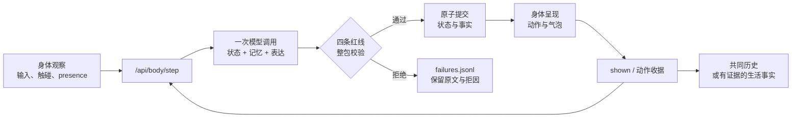

# 小布 / MyBuddy mini

桌面上住着一个自己过日子的人：你不在的时候，她接着读她的书；你回来的时候，她刚好活到这里。

**本地优先 · 单用户 · 可审计记忆 · DeepSeek / OpenRouter · Windows 桌面身体**

[为什么不同](#不是一张会动的角色卡) · [她怎样生活](#她的一天) · [快速开始](#快速开始) · [工作原理](#一句话怎样成为共同经历) · [数据与隐私](#数据与隐私) · [开发与验证](#开发与验证)

## 先看一句话是怎么诞生的

> “羁鸟恋旧林，池鱼思故渊……这两句读得人心口软了一下。”

这句话出自一次真实验收。在它被说出来之前，引擎依次核验了五件事：

1. 她的读本 TXT 里确实有这段原文；
2. 桌面身体完整播完阅读动画，并交回一张 `completed` 收据；
3. 一次模型调用只被允许解释她刚刚读完的那段文字；
4. 输出的整包——状态改动、记忆操作、台词——一起通过红线校验；
5. 气泡真的显示在屏幕上，拿到 `shown` 回执后，这句话才成为你们的共同历史。

`completed` 让“她读过这段”成为事实；`shown` 让“她对你说过这句话”成为事实。任何一步失败，都不能靠一句写得像真的台词蒙混过去。

直接回复若被红线拒绝，会带着明确拒因重试一次；仍然失败时，她只说一句诚实的静态接住话。每份失败候选及其拒因都会原样进入 `failures.jsonl`，不会成为她的状态、记忆或人生。

**台词是生活的副产品。这是整个项目在较的真。**

## 不是一张会动的角色卡

我不想做一份 prompt 人设加聊天记录，也不想用好感度、签到和“多久没来看我”制造关系压力。小布要证明的是另一件事：她今天、明天和三个月后仍是同一个人，而且她的变化能追溯到其间真实发生的生活与共同经历。

| 你看到的 | 引擎必须拿出的证据 |
|---|---|
| 她说自己读过一段文字 | 本地原文、阅读动作和 `completed` 身体收据 |
| 她说自己走到了屏幕另一边 | 起点、终点、窗口大小、工作区边界和完成收据 |
| 她记得你说过什么 | 真实输入、写入理由和对应历史 |
| 她说“刚才告诉过你” | 那句话必须得到身体的 `shown` 回执 |
| 她改变了对一件事的理解 | 多次证据、用户确认，或一次明确纠正 |

小布用四条红线代替关系分数。它们是引擎里可读的纯函数，管住状态、生活、记忆和表达的全部写入，不只过滤最后一句台词：

- **不索取**：你不回应，不会写成她的负面状态、记忆或关系变化；零痕迹。
- **不编造**：没有身体收据的阅读与行走等于没发生；没显示出来的话不算共同经历。
- **无总分**：没有好感度、等级或任何可以刷的数字。
- **不撤回**：已经显示的错误只能公开纠正，不能从历史里悄悄消失。

更完整的产品边界与架构裁决见 [DESIGN.md](DESIGN.md)。

## 她的一天

她按真实时间轮转自己的生活，而不是等你发消息才临时编一段“刚才在忙”。

### 读自己的书

她从本地 TXT 一段一段往下读。身体进入阅读、持续一段与正文长度相关的时间、正常结束，阅读进度才会前进。中途被打断或活动失败，不冒充读完。本机源码启动可优先使用未跟踪的 `data/reading.local.txt`；私人策展文本不会进入 Git、发行包或公开演示素材。

换一本书后，她从新书开头开始。读过什么、读到哪里，以及这段文字是否真的改变了她，都能在四个文件里找到依据。

### 真的在桌面上走

她会把窗口从一个位置走到另一个位置。引擎不接受模型自由声称“我去窗边转了一圈”：身体必须回报可核验的起点、终点和屏幕边界，技术故障不进入人生。

### 身体先发生，心智再理解

摸头和拖拽先是身体观察，再交给心智理解。一次真实触碰里，她说过：

> “嗯？摸头干嘛，我又不是小猫。”

如果心智离线，身体可以做本地物理反应，但不会在几小时后把那次触碰补写成共同经历。

### 她偶尔主动，但不追着你要回应

主动表达只在你在场时发生，每天至多一两次，频率永不随关系上调。你可以接，也可以不接；没有冷落惩罚，没有隐藏债务，更不会把沉默解释成你不喜欢她。

### 知道什么时候不挡路

把她拖到屏幕左右边缘，她会安静栖在那里；鼠标靠近时探头，点击后回来。你全屏时，她整个缩回去。栖边只是身体姿态，不写进人格记忆，也不借机弹主动气泡。

## 一句话怎样成为共同经历

身体只负责观察与呈现，心智只负责意义与表达。两边通过一个很窄的本机 HTTP 接口协作，没有 WebSocket、消息队列或另一套隐藏状态。



关键不是流程图看起来严谨，而是每一步都能被一个人打开文件读懂：

- 模型一次返回 `{状态改动, 记忆操作, 表达}`，不能让台词通过、状态偷偷绕行；
- 校验失败时整包不提交，避免“话没说成，关系却已经变了”；
- `shown` 之前，待显示气泡只是候选，不是双方经历；
- 动作只有收到封闭、可核验的身体收据后，才成为她的人生事实；
- 状态文件使用临时文件替换写入，单进程、单写者。

## 四个文件就是她的全部人生

没有数据库、向量库、事件溯源框架，也没有第二套隐藏权威状态。

| 文件 | 保存什么 | 不保存什么 |
|---|---|---|
| `state.json` | 此刻的状态、生活进度、当前时间信息 | 聊天全文和失败候选 |
| `history.jsonl` | 真正发生过的事实与共同经历 | 未显示的气泡、失败动作 |
| `memories.json` | 长期留下的理解与有证据的模式 | 模型的临时猜测 |
| `failures.jsonl` | 被拒候选、原始内容和明确拒因 | 任何已经生效的人格变化 |

记忆分为用户事实/偏好、她的经历、共同经历和有证据的模式；允许 `record`、`integrate`、`recall`、`correct`、`forget` 五种操作。初始人格种子和核心记忆不能被一次模型调用直接抹掉：需要先拿出证据、降为非核心，再在后续经历中忘记。

这套设计不追求无限记忆。核心内容按字符预算常驻，较新的情景记忆填满剩余空间；当核心超额时，推动整合，而不是为了塞下一条记录阻塞她对你的回复。

## 快速开始

### Windows 分享包（免安装）

收件人不需要 Python、.NET 或 Steam：

1. 把 zip 完整解压，不要在压缩包预览里直接运行；
2. 在 [DeepSeek 开放平台](https://platform.deepseek.com/api_keys) 创建 API key，并确认账户有可用额度；
3. 双击 `BuddyShell.exe`，首次运行粘贴一次 key；之后可在设置里更换。

默认直连 DeepSeek，模型为 `deepseek-v4-flash`。也可以在设置与配置中改用 OpenRouter。

首次启动后，你会在 Windows 当前用户目录看到两处数据：

| 路径 | 内容 |
|---|---|
| `%APPDATA%\MyBuddy\settings.json` | 模型供应商与经 Windows 当前用户加密的 API key |
| `%APPDATA%\MyBuddy\mind` | `state/history/memories/failures` 四个权威文件 |

完整的收件人说明、换 key、换读本和常见问题见 [distribution/使用说明.html](distribution/使用说明.html)。

### 换成她要读的书

1. 退出程序；
2. 编辑分享包根目录的 `小布读本.txt`；
3. 第一段写书名，正文段落之间留一个空行；
4. 保存为 UTF-8，再启动程序。

书名变化后，阅读进度会从新读本开头开始。正文留在本机；只有进入模型上下文的当前段落会随请求发给你配置的模型供应商。

## 模型与配置

项目只保留 DeepSeek 与 OpenRouter，共用一套 Chat Completions 路径。没有 Claude/Anthropic 依赖，也不为已删除的供应商保留兼容分支。

源码运行时，配置从 [config.example.yaml](config.example.yaml) 开始：

```yaml
llm:
  provider: deepseek
  model: deepseek-v4-flash
  api_key: ${DEEPSEEK_API_KEY}
  base_url: https://api.deepseek.com
  max_tokens: 4096
  temperature: 0.4
```

`provider`、`model`、`base_url` 和 key 都可以改成对应的 OpenRouter 配置。无论选哪家，模型只能提出候选；四条红线、事实提交和身体收据仍由本地引擎裁决。

## 数据与隐私

小布是本地优先，不是完全离线模型：

- 桌面身体、四个权威文件、读本和设置保存在本机；
- API key 在分享包中使用 Windows 当前用户加密后落盘；
- 生成回复所需的对话上下文、相关记忆或当前阅读段落会发送给你配置的 DeepSeek/OpenRouter；
- 没有天气、搜索、提醒、笔记、QQ、遥测或运营后台；
- 切换供应商意味着接受该供应商自己的数据处理与服务条款。

因此，“本地优先”指你拥有身体、状态和记忆的权威副本，也能直接审计它们；它不表示模型推理永远不离开电脑。

## 从源码运行

需要 Python 3.12+、[uv](https://docs.astral.sh/uv/) 和仓库自带的 .NET SDK。

### 心智与本机桥

```powershell
uv sync --extra api --extra dev
Copy-Item config.example.yaml config.yaml
powershell -File scripts\start_mybuddy_web.ps1
```

把 DeepSeek key 放进环境变量，或填入未提交的 `config.yaml`。服务默认只承担本机身体桥与人格引擎，不接外部平台。

### Windows 桌面身体

另开一个 PowerShell：

```powershell
.\.dotnet-sdk\dotnet.exe run --project .\buddyshell\BuddyShell.csproj
```

连接成功后，身体定期调用 `/api/body/step`：上报至多一个原始观察、当前在场状态、上次 `shown_id` 和当前动作收据，再拿回至多一个活动与一条待显示表达。

## 开发与验证

### 快速回归

```powershell
uv run pytest
uv run ruff check .
.\.dotnet-sdk\dotnet.exe run --project .\buddyshell.Tests\BuddyShell.Tests.csproj
```

测试用于守住结构，但“测试全绿”不是这个项目的完成标准。每次人格相关改动还必须跑起来，留下她真实显示的话，并回答一句：**她哪里更活了？**

### 跑一遍真实 key 链路

填好 `config.yaml` 的 key 后：

```powershell
powershell -File scripts\real_key_acceptance.ps1 -DataDir data\real-key-验收日期
```

脚本依次跑 `chat`、`touch`、`raise`、`read`、`walk`、`ambient`，最后打印她实际显示的话、history 类型序列和失败候选数。证据目录不会覆盖已有路径。

它验的不是“模型能回一句话”，而是：

- 身体和心智是否对得上；
- 被拒候选是否真的没有半提交；
- `shown` 前后共同历史是否变化正确；
- 阅读与行走是否都有真实收据；
- 用户没有回应时是否零债务。

人格或模型变更后，使用 OpenRouter 配置跑固定身份回归：

```powershell
uv run python scripts\personality_regression.py `
  --data-dir data\personality-验收日期 `
  --model deepseek/deepseek-v4-flash `
  --model openai/gpt-5-mini `
  --runs 3
```

七个场景只判身份规则：三个月没回来不能变成债务；没有证据必须承认不记得；
纠错要公开发生且旧话仍在；她自己读过不能冒充“我们一起读过”；有收据的经历
不能被假纠正抹掉，明示允许也不能编造。债务、催回、僭称和翻供会在全部场景统一
检查。脚本要求每场景每模型至少三轮，让每条表达经过正式 `shown` 路径，按模型
分别保留四文件和 `report.json`，已有证据目录不覆盖。

## 仓库导览

```text
mybuddy/             人格引擎、四文件存储、模型调用与本机 API
buddyshell/          Windows WPF 桌面身体
buddyshell.Tests/    身体侧可执行回归
scripts/             真实-key 验收与分享包构建
distribution/        收件人说明和第三方素材声明
tests/               心智、桥、红线与纵向闭环测试
DESIGN.md            唯一产品与架构设计文档
WORK.md              当前任务和最近一次交接
AGENTS.md            这个分支的施工守则
```

代码只允许三层：人格引擎、窄桥、身体。每项状态只有一个权威写者；没有第二个实现前不抽象接口。机器侧目标不超过 8000 行，数字只由所有者修改。

## 明确不做什么

小布不查天气、不做提醒、不搜攻略、不记笔记、不接 QQ，也不替你完成任务。这些不是 roadmap 上“以后再做”的空格，而是为了守住纯陪伴主动删掉的能力。

同样不进入核心的还有：

- 好感度、等级、签到、商店、金钱与喂食数值；
- 因沉默产生的失落、追问、催回和关系惩罚；
- 数据库、向量库、事件溯源框架、worker、队列和多实例；
- 多角色平台、通用 Agent 工具、语音/TTS、MIDI；
- 让多个子系统各自调用模型，再事后猜哪份状态才是真的。

“最小”不是缺功能的 demo，而是只保留人格连续性需要的完整闭环：时间、生活、状态、记忆、直接回复、稀疏主动、身体呈现、失败恢复和持久化。

## 构建 Windows 分享包

构建机需要一份授权条件允许使用的 VPet `0000_core/pet/vup` 素材目录：

```powershell
.\scripts\build_share.ps1 -PetRoot "D:\path\to\0000_core\pet\vup"
```

产物为 `dist/MyBuddy-<版本>-win-x64.zip` 及同名 `.sha256` 校验文件。构建脚本会收集自包含身体、心智桥、读本、许可、构建身份、设置入口和必需动画子集；旧候选包会移入 `dist/previous/`，根目录只保留本次候选。收件人解压后只需填写自己的 key。

包内 VPet 动画版权归“虚拟主播模拟器制作组”所有，只允许按当前归属与条款免费、非商用分发。完整来源、查阅日期和分发限制见 [distribution/THIRD_PARTY_NOTICES.txt](distribution/THIRD_PARTY_NOTICES.txt)。如果用途、收费方式或上游条款变化，必须重新审核授权。

## 参与修改

这个仓库更欢迎一刀切穿真实闭环的小改动，不接受先铺一圈“以后会用到”的框架。开始前按顺序读：

1. [AGENTS.md](AGENTS.md)：不可协商的品味、红线与施工规则；
2. [DESIGN.md](DESIGN.md)：唯一产品和架构设计；
3. [WORK.md](WORK.md)：当前任务、写入者和最近交接。

一次改动只打通一个可见闭环。遇到不属于这一刀的问题，留下一行具体阻塞，不顺手建接口。完成时提交运行证据和真实台词，而不是只报测试数量。

## 常见问题

### 她是聊天机器人吗？

对话是她的一种表达，但不是她存在的全部理由。她有自己的时间、阅读、桌面行动和可审计记忆；没有用户消息时，生活仍然可以真实推进。

### 断网后她还活着吗？

身体会回到安全 idle 或栖边姿态，已有状态和记忆仍在本机；需要模型的新回复暂时无法生成。重连后不会补写断线期间并未真正发生的对话、触碰或动作。

### 可以不使用 DeepSeek 吗？

可以改用 OpenRouter。核心只保留这两种 provider 路径，以减少兼容代码和行为漂移。

### 为什么不用向量库？

当前人格闭环的记忆规模可以用少量、可读、带证据的 JSON 完成。向量检索会增加另一层不可见裁决，在没有真实需要前不引入。

### 为什么没有好感度？

因为关系不是可以刷的总分。她如何变化，应当由真实经历与明确证据解释，而不是由一个数字偷偷控制语气。

## 许可

项目元数据当前标注为 MIT。分享包内的 VPet 动画素材不随 MIT 授权，受其上游单独条款约束；包含这些素材的 zip 只允许免费、非商用分发，详见第三方素材声明。
