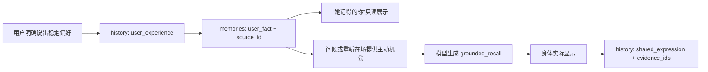

# 个性化智能体：导师要求对照与演示验收说明

> 文档性质：阶段成果汇报与现场验收说明
>
> 需求来源：`会议纪要(1).md` 中 01:22:24—02:37:44 的项目讨论
>
> 对应分支：`codex/mentor-proactive-demo`
>
> 当前提交基线：`57b937e`
>
> 演示数据：合成验收轨迹，不是真实用户历史

## 1. 阶段结论

会议纪要要求产品在操作中直观展示三项核心能力：长期记忆、主动性和个性化
建模。当前演示分支已经形成一个可运行的最小闭环：

1. 用户明确表达的稳定偏好连同原话与时间进入长期记忆；
2. 用户打开“她记得的你”时，可直接看到当前偏好及其证据来源；
3. 用户只说“你好”时，系统可从长期偏好中选择一个具体主题主动展开，而不是
   机械复述问候；
4. 被采用的记忆通过 `expression_evidence_ids` 与实际显示的表达相连，能够追溯
   “记住了什么、为什么想起、最终说了什么”；
5. 画像查看是只读操作，不调用模型，也不修改状态、历史、记忆或失败记录。

因此，当前版本已经满足“让人仅凭操作感受到长期记忆、个性化和主动性”的阶段
演示要求。它尚不是会议中设想的完整行业规范：没有知识库、向量库或 RAG，也没有
实现完整的四类个性化数据资产。本文将已实现能力与后续方向分开陈述，不以演示原型
冒充完整成果。

## 2. 导师要求与当前实现对照

| 会议位置 | 导师要求 | 当前实现 | 现场证据 | 结论 |
|---|---|---|---|---|
| 01:22:24—01:23:59 | 8 月初阶段成果应突出长记忆、主动性、个性化建模 | 独立演示分支已跑通三者的最小闭环 | 画像窗口、问候触发、四文件轨迹 | 阶段满足 |
| 02:09:41 | 演示案例必须提前准备，操作本身能体现价值 | 固定 4 条合成偏好与对应历史；演示不依赖临场编数据 | `DEMO_DATA.md` 与演示目录 | 满足 |
| 02:11:29 | 不能像知识库模板回答，应体现个性化 | 表达正文由模型生成；长期偏好只提供证据与话题起点 | “你好”后引用具体偏好 | 满足 |
| 02:13:21—02:15:05 | 收到问候时像熟人一样主动开题 | 普通问候可选择一条有原话来源的长期偏好自然展开 | 手绘地图、鸟、科幻或老建筑话题 | 满足 |
| 02:16:52 | 主动性应由长记忆和上下文驱动，而非定时规则 | 问候和重新在场提供机会，内容来自持久化记忆；未回应不产生债务 | `grounded_recall` 证据与 `shown` | 满足 |
| 02:18:43 | 展示用户特征的提取、激活与学习过程 | 原话写入、当前记忆、来源展开、激活表达均可审计 | `user_experience → user_fact → shown` | 阶段满足 |
| 02:20:33 | 明确未回答与已有成果的边界 | 未显示表达不进入共同历史；未回应不写负面状态或关系变化 | `shown` 前后历史差异 | 满足 |
| 02:22:19 | 当前重点是主动性和个性化建模，不是外在形象 | 演示主流程聚焦“忆”页面、主动话题和证据链 | 3 分钟核心演示 | 满足 |
| 02:24:10 | 个性化可扩展为偏好、知识库等多种数据结构，可考虑 RAG | 当前只实现有证据的偏好及交互证据；未引入知识库、向量库或 RAG | 本文第 3、6 节 | 部分满足 |
| 02:32:38—02:37:44 | 输出 `personalize` 顶层的数据结构、字段和格式规范 | 本文给出当前可运行闭环的逻辑视图与字段表 | 第 3 节 | 当前范围满足 |

## 3. `personalize` 逻辑结构规范

`personalize` 是面向演示和接口说明的逻辑视图，不是第五份持久化文件，也不要求
创建同名物理目录。底层权威仍只有 `state.json`、`history.jsonl`、
`memories.json` 和 `failures.jsonl`。

```text
personalize
├─ preferences        当前仍有效的用户偏好
│  └─ preference_item 用户原话、来源、形成时间
├─ evidence           偏好的原始交互证据
│  └─ user_experience 用户实际说过的话
├─ activation         记忆被哪次表达采用
│  └─ grounded_recall 表达与 evidence_id 的连接
└─ interaction        表达是否真正呈现
   └─ shown           只有显示过的内容才成为共同历史
```

### 3.1 当前画像字段

| 字段 | 类型 | 字数/格式 | 含义 | 约束 |
|---|---|---|---|---|
| `memory_id` | string | 非空唯一 ID | 当前长期事实的地址 | 不由界面生成 |
| `quote` | string | 保留用户原话，不另写摘要 | 个性化内容 | 必须与来源正文完全一致 |
| `source_id` | string | 非空唯一 ID | 原始用户经历地址 | 必须指向 `user_experience` |
| `source_occurred_at` | datetime string | ISO 8601 | 用户说出原话的时间 | 不允许倒填推测时间 |
| `created_at` | datetime string | ISO 8601 | 长期记忆形成时间 | 由引擎盖戳 |

画像中每条偏好只显示一个原话段落，不规定人为凑字数。段落长度由用户原话决定；
界面只负责自动换行。没有来源、来源类型不符或原话不一致的项目不得显示。

### 3.2 激活与显示字段

| 字段 | 所在记录 | 含义 |
|---|---|---|
| `expression_act` | 待显示/已显示表达 | `grounded_recall` 表示正在引用有据记忆 |
| `expression_evidence_ids` | 待显示/已显示表达 | 本次表达实际采用的证据 ID |
| `expression_id` | 表达及 `shown` | 一次具体表达的稳定标识 |
| `shown_id` | 身体确认 | 证明表达确实出现在用户面前 |

### 3.3 提取、存储、激活与学习闭环



这里的“学习”指证据支持下的写入、纠正、整合和忘记，不指后台根据沉默猜测用户。
沉默、未回答和时间流逝不会自行产生新的用户特征。

## 4. 合成演示数据

当前演示使用独立目录：

```text
data/mentor-proactive-acceptance-20260729-v2
```

该目录包含 4 条合成稳定偏好：

1. 聊鸟时关注它们如何选择落脚点；
2. 聊科幻时关注陌生文明第一次接触造成的误解；
3. 喜欢手绘地图中的细节取舍；
4. 散步时留意老建筑的窗户和门牌。

每条偏好都具有独立的 `user_experience`、`memory_operation` 和后续表达记录。
这些内容只用于功能演示和回归验收，必须在汇报开始时声明为合成数据，不得描述为
真实用户画像。

## 5. 现场演示脚本

### 第一段：个性化建模可见（约 60 秒）

1. 说明本次使用合成演示轨迹；
2. 点击工具栏“忆”或托盘“她记得的你”；
3. 展示 4 条当前偏好；
4. 展开任意一条“查看原话来源”；
5. 指出原话、发生时间和 `source_id`；
6. 强调页面没有性格标签、亲密值或关系总分。

现场讲解：

> 这里展示的不是模型临时总结，而是当前仍有效、并且能回到用户原话的长期偏好。
> 系统没有替用户定义性格，每一条个性化内容都能说明依据。

### 第二段：长期记忆驱动主动性（约 60—90 秒）

关闭画像页面，在聊天框只输入：

```text
你好
```

预期现象：系统不是机械回复“你好”，而是从尚可使用的长期偏好中选一个具体角度
展开话题。模型轮次可能需要 35—50 秒；壳的等待预算为 120 秒，等待期间输入不会
因旧版 15 秒超时而丢失。

若现场网络或模型不稳定，使用确定性问题：

```text
你还记得我散步时喜欢看什么吗？
```

预期回答应基于“老建筑的窗户和门牌”，并带相应记忆证据。

### 第三段：过程证据而非只看答案（约 60 秒）

1. 展示偏好对应的 `source_id`；
2. 在 `history.jsonl` 中定位同 ID 的 `user_experience`；
3. 定位引用该证据的 `shared_expression`；
4. 指出只有 `shown` 后，表达才进入共同历史；
5. 说明画像查看前后四个权威文件的 SHA-256 不变。

现场讲解：

> 最终回答只是结果。这里还能看到证据是否被找到、记忆是否被正确形成、表达是否
> 采用了它，以及这句话是否真的显示给用户，因此可以定位问题发生在哪个过程。

## 6. 十点验收表

| 序号 | 验收项 | 操作 | 通过标准 |
|---|---|---|---|
| 1 | 数据披露 | 打开 `DEMO_DATA.md` | 明确写明合成数据 |
| 2 | 长期持久化 | 重启心智与桌面壳 | 4 条偏好仍存在 |
| 3 | 画像可见 | 点击“忆” | 页面显示 4 条偏好 |
| 4 | 原话证据 | 展开来源 | 原话与记忆正文一致 |
| 5 | 时间证据 | 查看卡片与来源 | 存在 ISO 8601 时间 |
| 6 | 无隐藏推断 | 浏览整页 | 无性格标签、关系总分 |
| 7 | 只读查看 | 查看前后计算四文件哈希 | 四个 SHA-256 均不变 |
| 8 | 个性化主动 | 输入一次“你好” | 主动引入一条有据偏好 |
| 9 | 非模板表达 | 对比历史中的不同回应 | 正文不是固定模板拼接 |
| 10 | 可靠呈现 | 等待 35—50 秒并完成 `shown` | 不变黄丢答，显示后才入史 |

## 7. 当前边界与后续工作

### 已经完成

- 有证据的用户偏好写入与跨重启持久化；
- 问候或重新在场时由长期记忆提供主动话题；
- 个性化画像的按需只读展示；
- 原话、时间、来源和表达激活的过程追溯；
- 35—50 秒模型轮次所需的壳等待预算；
- 合成演示数据与真实数据隔离。

### 尚未完成或不应夸大

- 当前画像是“有证据的偏好视图”，不是完整心理画像；
- 尚未实现会议设想中的完整四类个性化数据资产；
- 没有知识库、向量库或 RAG，不能将相关建议写成已实现；
- 当前功能位于独立演示分支，尚未合并主分支；
- 模型生成具有随机性，现场演示必须保留已跑通轨迹作为证据；
- 合成轨迹证明功能闭环，不证明系统已经在真实用户研究中取得效果。

## 8. 汇报结论

本阶段的核心成果不是增加了多少功能，而是把一条个性化链路完整地做成了可见、
可运行、可追溯的产品操作：

> 用户说过什么，被保存成哪条长期偏好，这条偏好何时被激活，系统最终说了什么，
> 是否真的显示给用户，都能沿同一条证据链核验。

她更活的地方是：她不再只等待用户重复旧话题，而能从确实留下的偏好中主动选择
一个具体角度开口；同时，她对用户的了解仍然有边界、能追溯，也允许纠正。
