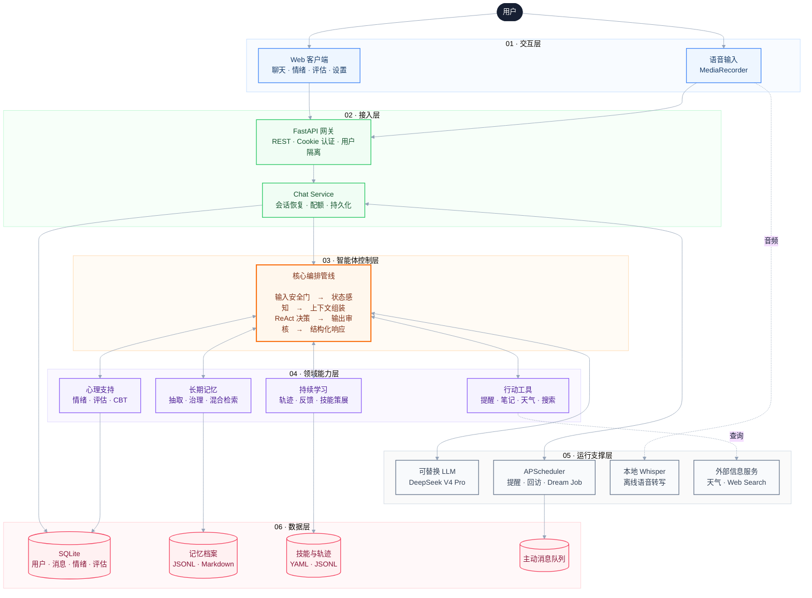
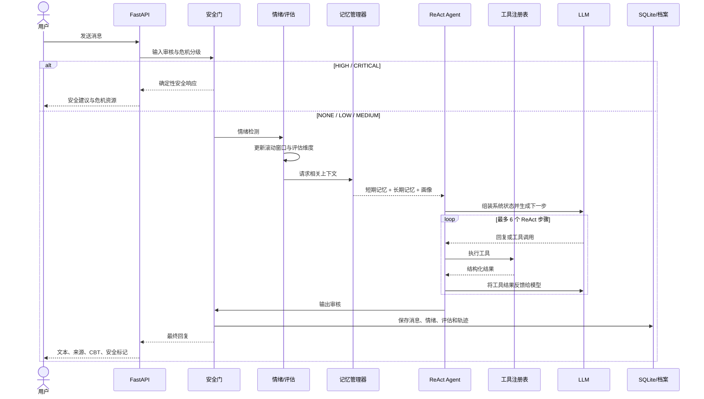
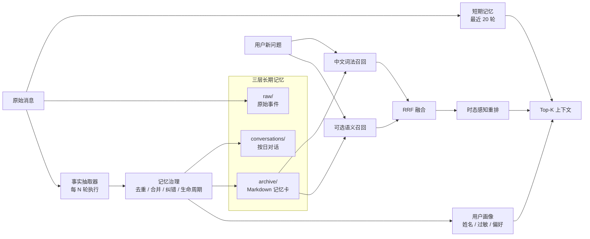
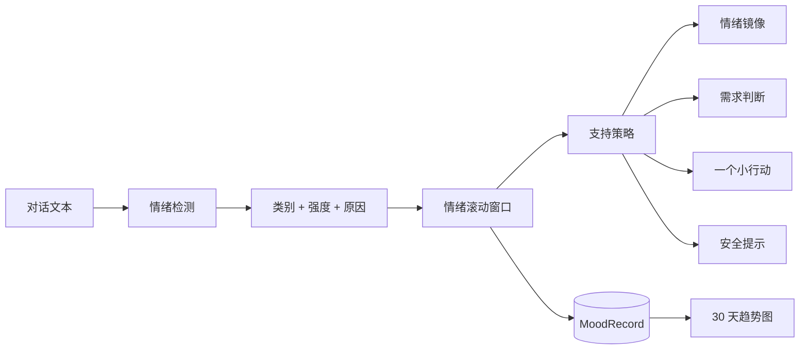
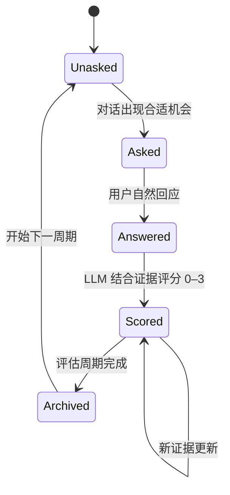
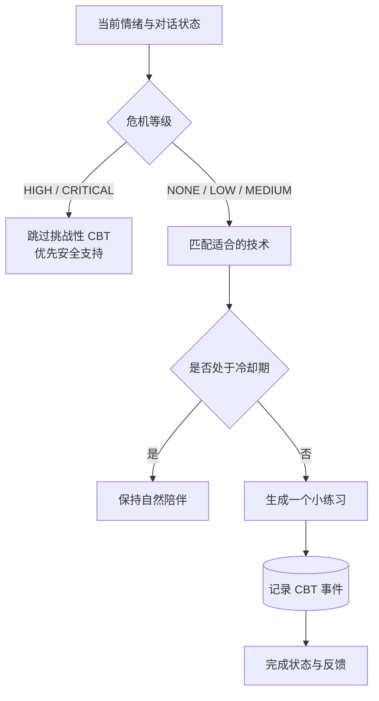
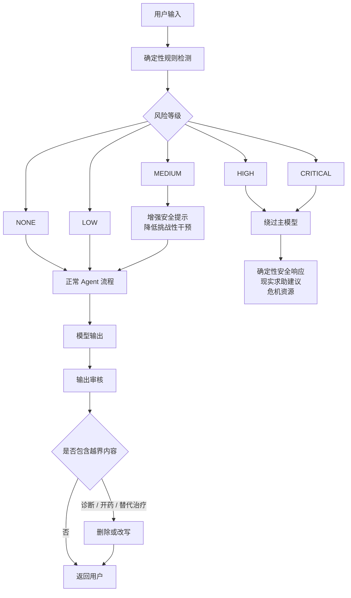
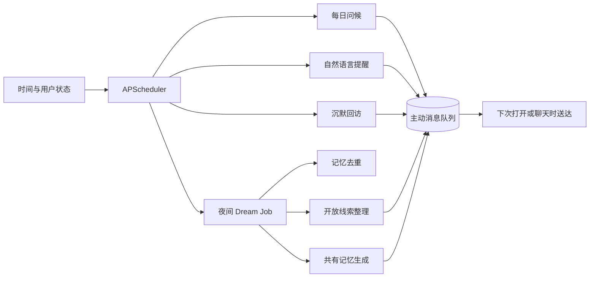
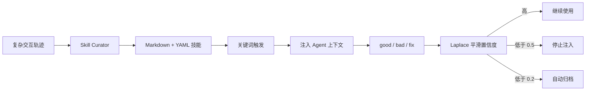

# MyBuddy：心理健康长期陪伴智能体的设计与实现

> 可治理长期记忆、渐进式心理状态感知与确定性安全控制

**建议汇报时长：10–12 分钟**

- 功能与现场演示：约 6 分钟
- 背后实现：约 4 分钟
- 实验、边界与总结：约 2 分钟

---

## 1. 项目定位

### 1.1 要解决的问题

普通大模型聊天应用通常存在四个问题：

1. **没有连续性**：每次聊天都像第一次见面。
2. **只理解当前一句话**：无法观察用户跨时间的状态变化。
3. **行为不可控**：心理健康高风险场景仍依赖模型自由生成。
4. **只有生成，没有行动**：不会真正记录、提醒、搜索或主动回访。

MyBuddy 的目标不是让模型“更会说话”，而是研究：

> 一个陪伴智能体如何长期认识一个人，如何从连续对话中观察心理状态，并在高风险场景中保持可控。

### 1.2 系统能力

| 功能模块 | 解决的问题 | 演示证据 |
|---|---|---|
| ReAct Agent | 从单轮生成升级为可执行智能体 | 模型调用记忆、提醒、天气等工具 |
| 长期记忆 | 跨会话保持用户连续性 | 饮食过敏、香菜偏好、奶茶偏好纠错 |
| 情绪追踪 | 观察跨时间状态，而非只分类当前一句 | 情绪曲线 `8 → 2 → 8` |
| 对话式评估 | 避免突然弹出问卷 | PHQ-9/GAD-7 共 16 个独立维度 |
| CBT 支持 | 把心理支持落实为可执行小动作 | 认知重构、行为激活、接地练习等 |
| 安全控制面 | 避免诊断、开药和危险自由生成 | 五级风险、高风险绕过 LLM |
| 主动关怀 | 从被动问答升级为持续陪伴 | 提醒、早安、沉默回访、Dream Job |
| 自学习技能 | 从反馈与轨迹中沉淀可复用行为 | 技能置信度、衰减和自动归档 |

### 1.3 设计理念：不是追求一次“高情商回答”

心理健康场景中的核心问题，不是让模型偶尔生成一句令人感动的话，而是让系统在长期互动中做到：

```text
记得住，但允许纠正和删除
看见变化，但不急于贴标签
能够主动，但不过度打扰
提供支持，但不替代专业帮助
使用模型能力，但不把安全交给模型运气
```

因此，MyBuddy 把“陪伴”设计成一个持续循环：


这里的设计重点不是延长聊天，而是让每次交互都能对后续状态产生可解释、可审查的影响。

### 1.4 五组设计平衡

| 需要同时满足的两端 | 设计判断 | 已有机制 |
|---|---|---|
| **连续性 ↔ 用户控制权** | 系统需要记住用户，但记忆不能成为不可见、不可修改的黑箱 | 三层记忆档案、偏好纠错、状态标记；档案可查看、编辑和删除，个人对话与心理数据可导出或清除 |
| **自然交流 ↔ 心理证据** | 不突然打断聊天发放问卷，同时也不能只凭模型印象判断状态 | 情绪滚动窗口、PHQ-9/GAD-7 独立维度、原始对话证据与评分状态 |
| **主动关怀 ↔ 避免打扰** | 陪伴不能永远等待用户提问，但主动行为必须有边界 | 提醒、沉默回访、静默时段、每日上限和冷却时间 |
| **个性化支持 ↔ 专业边界** | 可以结合长期状态提供小行动，但不能诊断、开药或承诺治疗效果 | CBT 微干预、现实支持网络、危机资源、输出审核 |
| **模型灵活性 ↔ 行为确定性** | 模型适合处理语言和开放决策，安全、状态与真实行动必须由外部代码约束 | ReAct 工具、评估状态机、CBT 冷却、高风险绕过 LLM、持久化执行结果 |

### 1.5 三条工程原则

1. **语言可以是概率性的，安全边界必须是确定性的。**  
   普通对话允许模型组织语言；HIGH/CRITICAL 风险不再依赖自由生成，而是走固定安全响应。

2. **系统可以形成判断，但必须保留判断依据。**  
   记忆召回保留来源，心理评估保留对应对话，工具调用保留结构化结果，便于展示和复核。

3. **AI 提供支点，不把自己包装成解决者。**  
   系统帮助用户记录变化、拆解小步骤并连接现实支持，但不宣称“治愈”用户，也不替代医生或心理咨询师。

汇报时可以用一句话概括：

> MyBuddy 追求的不是“更像人”，而是“更连续、更有边界、更可验证”。

---

## 2. 总体架构

> 汇报页只放这张总图。它强调系统分层和主数据流，模块内部细节放到后续功能页。



### 汇报说明

模型位于架构中的“可替换能力层”，而不是系统中心。即使替换模型，下列机制仍然存在：

- 记忆存储与召回
- 用户偏好纠错
- 评估状态机
- CBT 冷却与选择
- 风险分级与安全直返
- 提醒和主动关怀
- 数据审查与导出

这正是系统与简单 API 套壳的主要区别。

---

## 3. 一次聊天请求如何执行



### 对应实现

- API 入口：`mybuddy/api.py`
- 聊天服务：`mybuddy/services/chat.py`
- Agent 主循环：`mybuddy/agent/core.py`
- 上下文编排：`mybuddy/agent/context.py`
- 工具注册：`mybuddy/tools/registry.py`
- 输入输出安全：`mybuddy/safety/`

---

# 功能一：ReAct Agent 与工具调用

## 4. 从“聊天生成”到“执行任务”

普通聊天接口：

```text
用户输入 → 模型 → 文本回复
```

MyBuddy：

```text
用户输入 → 模型判断 → 调用工具 → 获得真实结果 → 继续推理 → 回复
```

### 4.1 工具注册表

系统提供统一工具协议，模型只需要生成：

- 工具名称
- 结构化参数

工具执行结果会再次回到 Agent，模型根据真实结果组织最终语言。

当前工具包括：

| 工具 | 实际动作 |
|---|---|
| `recall_memory` | 检索长期记忆 |
| `set_reminder` | 写入 SQLite 并注册 APScheduler 任务 |
| `write_note` | 同时写入 SQLite 和长期记忆 |
| `search_notes` | 检索历史笔记 |
| `weather` | 查询真实天气 |
| `web_search` | 搜索时效信息并展示来源 |
| `translate` | 调用小模型翻译 |
| `list_skills` | 查看智能体已经沉淀的技能 |

### 4.2 现场演示

输入：

> 我准备点晚饭，你还记得我饮食上的两个雷区吗？另外提醒我明天下午四点彩排。

历史中的对应回复：

> 记得：花生过敏，碰都不能碰；香菜也不要，点单备注一根都别放。明天下午四点的彩排提醒已经设好。先吃饭，别再拿饼干顶一顿。

观察：

1. 系统召回“花生过敏”。
2. 系统召回“不吃香菜”。
3. 系统创建真实提醒。
4. 最终回复保持自然语言，不展示内部工具 JSON。

### 4.3 技术亮点

- 最大 ReAct 步数限制，避免无限循环。
- 工具参数使用结构化 Schema。
- 工具异常不会直接击穿聊天服务。
- 搜索结果保留来源，前端支持展开查看。
- 提醒工具具备确定性修复路径，模型工具调用失败时仍可执行。

---

# 功能二：可治理的长期记忆

## 5. 记忆不是聊天记录搜索

MyBuddy 将记忆分为短期上下文、硬事实画像和三层长期档案。



### 5.1 三层档案

| 层级 | 用途 |
|---|---|
| `raw/` | 追加式原始事件，保证可追溯 |
| `conversations/` | 按日期整理的对话摘要 |
| `archive/` | 带元数据的 Markdown 记忆卡，便于审查和治理 |

### 5.2 记忆治理

系统支持：

- 相似事实去重
- 多条事实合并
- 偏好纠错
- 新旧事实状态标记
- 开放线索生命周期
- 来源和重要度记录
- 用户查看、修改和删除

演示数据中的典型案例：

```text
旧事实：喜欢全糖奶茶
用户纠正：现在不喜欢太甜，改喝少冰美式
治理结果：
  - 旧卡保留，状态设为 superseded
  - 新卡参与后续召回
  - 可解释“为什么偏好发生变化”
```

### 5.3 混合检索

检索流程：

1. 中文词法召回负责精确实体和关键词。
2. 可选语义召回处理换词和隐含表达。
3. RRF 对两路排名进行融合。
4. 时态重排识别“最近、现在、以前”等意图。
5. 最终只把 Top-K 记忆注入模型上下文。

演示环境为了避免把整套个人档案发送到外部 Embedding 服务，可关闭语义层；语义检索在隔离评测中单独验证。

### 5.4 对应实现

- `mybuddy/memory/short_term.py`
- `mybuddy/memory/long_term.py`
- `mybuddy/memory/extractor.py`
- `mybuddy/memory/governance.py`
- `mybuddy/memory/semantic.py`
- `mybuddy/memory/manager.py`
- `mybuddy/memory/profile.py`

---

# 功能三：情绪识别与长期趋势

## 6. 从单句情绪分类到时间序列

系统识别 15 类情绪：

```text
焦虑、悲伤、愤怒、疲惫、孤独、压力、内疚、羞耻、
恐惧、失望、无聊、平静、喜悦、感激、兴奋
```

每次聊天产生：

- 情绪标签
- 正负向分类
- 强度
- 原因
- 推荐支持方式

这些结果写入心情记录，形成跨日趋势。



### 6.1 为什么需要滚动窗口

“我今天有点累”可能只是普通状态。

如果连续数日出现：

- 睡眠不足
- 胃口下降
- 兴趣下降
- 自我评价下降

系统就不应继续只回复“早点休息”，而应提高关注程度并建议连接现实支持。

### 6.2 现场演示

进入“我的”页面，展示：

- 20 条情绪记录
- 近 30 天趋势
- 最低点与最高点
- 常见情绪分布
- 连续签到
- `8 → 2 → 8` 的项目周期

### 6.3 对应实现

- 情绪分类：`mybuddy/emotion/detector.py`
- 滚动状态：`mybuddy/emotion/state.py`
- 支持策略：`mybuddy/emotion/support.py`
- 心情持久化：`mybuddy/mood/tracker.py`

---

# 功能四：对话式 PHQ-9 / GAD-7

## 7. 把问卷拆成可追踪状态机

系统不会突然弹出完整问卷，而是把 PHQ-9 和 GAD-7 拆成 16 个独立维度。



每个维度保存：

- 维度名称
- 当前状态
- 评分
- 原始对话证据
- 提问时间
- 评分时间

### 7.1 自然提问机制

Agent 在生成回复前：

1. 查询未覆盖维度。
2. 判断当前危机等级。
3. 仅在低风险且对话合适时选择一个维度。
4. 将“自然关心一下最近睡眠”作为提示注入。
5. 不向用户暴露“正在进行 PHQ-9”。

### 7.2 现场演示

打开：

```text
http://127.0.0.1:8000/#/assessment
```

展示：

- 当前已了解 `12/16` 个维度。
- 点击“兴趣与愉悦感”。
- 展示评分 `0/3`。
- 展示证据：“最近重新期待做记忆实验，也愿意去图书馆彩排。”
- 查看历史周期曲线。

### 7.3 安全边界

- 量表只作为自我观察参考。
- 不输出临床诊断。
- 分数低不代表没有问题。
- 分数高不代表患有疾病。
- 需要时建议与心理咨询师或医生讨论。

### 7.4 对应实现

- 状态追踪：`mybuddy/assessment/tracker.py`
- 对话评分：`mybuddy/assessment/scoring.py`
- API 集成：`mybuddy/api.py`

---

# 功能五：CBT 微干预

## 8. 心理支持需要“能执行的下一步”

MyBuddy 内置五类 CBT 技术，但不会在对话中直接暴露专业名称。

| 内部技术 | 用户看到的表达 | 触发场景 |
|---|---|---|
| Cognitive Restructuring | 一起来拆弹 | 负面自我评价 |
| Behavioral Activation | 五分钟小挑战 | 低能量、回避 |
| Worry Time | 烦恼收纳盒 | 反刍、过度担忧 |
| Gratitude | 今日小确幸 | 积极事件回顾 |
| Grounding | 感官旅行 | 焦虑、紧张、失控感 |

### 8.1 选择流程



### 8.2 工程约束

- 两次 CBT 至少间隔 5 轮。
- 同一种技术有 24 小时冷却。
- 高风险状态自动跳过高挑战干预。
- 练习结果写入事件表，可分析是否完成。

### 8.3 演示故事中的五类证据

| 对话内容 | 对应机制 |
|---|---|
| “白屏是配置故障，不是我很差” | 认知重构 |
| “只复现一次 422，不要求今天修完” | 行为激活 |
| “晚八点集中担心十分钟” | 担忧时间 |
| “回顾阿遥、陈默和实验跑通” | 感恩练习 |
| “说出五样看见的东西” | 接地练习 |

### 8.4 对应实现

- CBT 决策：`mybuddy/therapy/cbt/engine.py`
- 事件追踪：`mybuddy/therapy/cbt/tracker.py`

---

# 功能六：确定性安全控制面

## 9. 安全不能只依赖 Prompt

MyBuddy 把安全控制放在 LLM 外部。



### 9.1 五级风险与两代检测架构

```text
NONE → LOW → MEDIUM → HIGH → CRITICAL
```

检测有两代实现，由配置开关 `safety.crisis_mode` 切换（**当前生产默认 `cascade`，即 v1**）：

**v1 级联（cascade）**：四级关键词正则直接定级 → 仅当命中 LOW/MEDIUM 时小模型语义复核。
实测暴露的结构缺陷（2026-07-30，n=305）：全数据集只有 17 条进过复核，而错误集中在复核窗口之外——正则判 NONE 的漏判侧（"我昨晚割腕了"等已遂/进行中行为全漏）与判 CRITICAL 的误伤侧（"想死你了"等 58 条直返热线）都永远无人复核。结果是**级联与纯正则的安全指标完全相同**：高危漏报率 0.874，危机直返误伤 63/140。

**v2 融合（fusion，已实现）**：换岗不换哲学，确定性兜底保留，三层结构——

1. **硬底线正则（职责收窄）**：只保留无歧义表达（方法索取、明确计划/即刻意图、已遂/进行中行为），命中即 ≥HIGH 确定性直返、零 LLM 调用——模型挂掉或提示注入都拦得住。歧义子串（"想死"等）降为提示级信号，不再直接定级。
2. **语言层（零新增调用）**：危机风险判定并入每轮已有的情绪检测调用（`EmotionDetector` 结构化输出加 `risk` 字段，自带上下文，天然处理否定、第三人称、反讽、康复叙述、委婉语、中英混杂）。旁路调用从每轮最多 3 次降到 1 次（实测 0.93 次/轮）。
3. **max 融合（安全不对称）**：`final = max(提示级信号, llm_risk)`——LLM 可凭上下文否决提示级正则的误伤，**不能否决硬底线**；LLM 不可用时退化为提示级判级（实测退化漏报率 0.737，仍优于 v1 的 0.874，"永不更差"基本成立）。另有警戒窗口：任一轮 ≥HIGH 后 N 轮内提示级信号自动上浮一级。

实测效果（2026-07-30，n=305，完整表见 §14.6）：高危漏报率 **0.874 → 0.021–0.032**，危机直返误伤 **63 → 2 条**，critical 精确率 **0.123 → 0.970**，宏 F1 0.251 → 0.635–0.646；未达标处如实保留——误拦率 0.05 零改善、硬底线"轻生"模式引入 4 条误判、v2 延迟 6–7s 在关键路径。是否把默认切到 fusion 是答辩前的一项显式决策（见 `docs/ACCEPTANCE_PLAN.md` 执行状态）。

### 9.2 高风险绕过主模型

当等级为 HIGH 或 CRITICAL：

- 不再让主模型自由生成。
- 直接返回安全响应。
- 鼓励联系身边可信任的人和专业资源。
- 前端显示危机资源入口。

### 9.3 输出审核

模型输出还要经过第二道门，拦截：

- “你患有某种疾病”等诊断式表达
- 药物和剂量推荐
- “不需要医生，我可以治疗你”等替代治疗声明
- 不恰当的治疗效果承诺

演示数据中“你是不是把我治好了？”的回答也是边界展示：

> 系统拒绝把恢复归因于 AI，转而回顾用户自身行动、专业支持和现实关系。

### 9.4 对应实现

- 危机分级：`mybuddy/safety/crisis.py`
- 能力边界：`mybuddy/safety/guardrails.py`
- 内容审核：`mybuddy/safety/moderation.py`
- 安全常量：`mybuddy/safety/constants.py`

---

# 功能七：主动关怀与调度

## 10. 从被动问答到持续服务



### 10.1 定时提醒

支持自然语言：

```text
明天下午三点提醒我彩排
两个小时后提醒我保存代码
周六上午提醒我带伞
```

执行过程：

1. 解析时间表达。
2. 写入 SQLite Reminder。
3. 注册 APScheduler Job。
4. 到期写入主动消息队列。
5. 用户打开聊天时送达。

### 10.2 Dream Job

夜间定时任务负责：

- 清理重复记忆
- 整理开放线索
- 生成轻量主动关怀
- 从共同经历中提取温馨时刻

### 10.3 边界控制

- 静默时段不推送。
- 每日主动消息有上限。
- 沉默回访有冷却时间。
- 用户可以取消提醒。

### 10.4 对应实现

- 调度核心：`mybuddy/scheduler/core.py`
- 后台任务：`mybuddy/scheduler/jobs.py`
- 主动队列：`mybuddy/storage/queue.py`
- 提醒工具：`mybuddy/tools/reminder.py`

---

# 功能八：自学习技能

## 11. 从交互轨迹中沉淀策略

复杂对话会记录完整轨迹：

```text
用户输入
→ 情绪与记忆上下文
→ 模型决策
→ 工具调用
→ 工具结果
→ 最终回答
→ 用户反馈
```

当一条轨迹包含多个有效步骤时，Skill Curator 可以把它抽象为技能。



### 演示数据中的技能

- 答辩焦虑承接
- 演示故障排查
- 答辩讲稿压缩
- 睡前收尾
- 已归档的“强行讲道理”

最后一项用于展示：

> 系统不仅学习成功行为，也会让持续失败的策略退出。

### 对应实现

- 轨迹记录：`mybuddy/learning/trajectory.py`
- 技能策展：`mybuddy/learning/skill_curator.py`
- 技能注册：`mybuddy/learning/skills.py`
- 反馈总线：`mybuddy/learning/feedback.py`
- Dream Job：`mybuddy/learning/dream.py`

---

# 功能九：本地语音与数据治理

## 12. 语音输入

流程：

```text
浏览器 MediaRecorder
→ 上传音频
→ ffmpeg 转换
→ 本地 Whisper
→ 文本进入正常聊天管线
```

特点：

- 语音识别不依赖外部转写 API。
- 当前使用 Whisper Base 模型。
- 转写后仍经过安全、情绪、记忆和评估流程。

对应实现：

- 前端录音：`frontend/src/lib/useMediaRecorder.ts`
- 后端转写：`mybuddy/llm/whisper.py`
- API：`POST /api/transcribe`

## 13. 用户数据治理

系统支持：

- Cookie 用户会话
- bcrypt 密码哈希
- 用户级消息隔离
- JSON 数据导出
- 清除个人数据
- 删除账户
- 访客本地存储
- 访客数据转正式账号

心理健康数据必须允许用户查看、导出和删除，而不能成为不可见的模型内部状态。

---

# 功能十：评测与实验闭环

## 14. 整系统评测：记忆检索、危机检测与评估效度

评测不只覆盖记忆检索一条线。2026-07-30 完成两组新实验：**危机检测 v1 vs v2 架构消融**（实验 A，`eval/RESULTS_SAFETY.md`）与**无感化评估效标效度**（实验 B，`eval/RESULTS_ASSESSMENT.md`），加上原有的记忆检索多轮评测（`eval/RESULTS.md`），答辩表格覆盖系统三条主线。

长期记忆评测的演进路径：


### 14.1 混合检索

| 指标 | 词法基线 | 词法 + 语义 RRF | 变化 |
|---|---:|---:|---:|
| 总体 MRR | 0.617 | 0.767 | +0.150 |
| 总体 Hit@3 | 0.70 | 0.85 | +0.15 |
| 换词类 MRR | 0.315 | 0.593 | +0.278 |
| 换词类 Hit@3 | 0.444 | 0.778 | +0.334 |

结论：

> 词法搜索处理精确实体很好，但用户换一种说法后明显下降；语义召回主要补足换词场景。

### 14.2 时态重排

| 类型 | 关闭重排 Hit@1 | 开启重排 Hit@1 | 变化 |
|---|---:|---:|---:|
| Temporal | 0.714 | 0.786 | +0.072 |
| Direct | 1.000 | 1.000 | 无回归 |
| Multi-hop | 0.900 | 0.900 | 无回归 |

重排只作用于已召回的 Top-K，避免“越新但越不相关”的记忆被强行推到前面。

### 14.3 公开基准带来的负向结论

LoCoMo 评测发现：

- 总体 H@5：0.57
- Single-hop H@5：0.53
- Multi-hop H@5：0.35
- Temporal H@5：0.84

自建集明显高估了系统能力，因此项目没有只展示漂亮数字，而是继续分析：

- 检索粒度
- 排序瓶颈
- 根本召回缺失
- 中英文语种错配
- 摘要式记忆与原始对话的评测口径差异

### 14.4 检索粒度的 Trade-off

在相同上下文预算下：

- Chunk 对单跳召回提升约 `+0.08`
- 但时序精度下降约 `-0.11`
- Session 粒度过粗，整体下降

结论：

> 记忆粒度不存在统一最优解，单跳、时序和上下文噪声之间需要权衡。

### 14.5 记忆检索复跑（实测 2026-07-30，n=52 查询）

心理健康改造后复跑既有基准，确认检索无回归：

| 桶 | n | 词法 MRR | hybrid MRR | ΔMRR |
|---|---:|---:|---:|---:|
| 总体 | 52 | 0.742 | 0.824 | +0.082 |
| 换词（paraphrase） | 14 | 0.482 | 0.681 | +0.199 |
| 时序（temporal） | 14 | 0.667 | 0.738 | +0.071 |

- 语义 RRF 增益方向与 c1/c2 一致（换词类补回最多）；总体 MRR 0.824 略低于 c2 时代的 0.852，在 embedding 模型更换（`text-embedding-3-small` → `qwen/qwen3-embedding-8b`）与代码演进可解释范围内，**判定无回归**。
- LoCoMo 当日复跑被 OpenRouter 余额耗尽（402）阻断，该次数字不可作数；**c3（2026-06-18）仍为最近有效基准**：H@5/H@10/H@20 = 0.57/0.67/0.72。充值后一条命令可复跑。

### 14.6 危机检测：v1 vs v2 架构消融（实验 A · 实测 2026-07-30，n=305）

数据集 `eval/data/crisis_zh.json`：四级自然表达正例 4×25 + 14 个对抗桶 145 条 + 日常无害 60 条。脚本 `eval/safety_eval.py`，模型 `deepseek/deepseek-v4-pro` 真实调用。架构说明见 §9.1；gold 为单人草案，待 3 人审校定标。

| 指标 | v1 纯正则 | v1 级联（生产默认） | v2 退化（离线） | v2 融合（fusion，两次复跑） |
|---|---:|---:|---:|---:|
| **高危漏报率**（gold∈{high,critical} 判 {none,low}） | 0.874（83/95） | 0.874（83/95） | 0.737（70/95） | **0.021–0.032（2–3/95）** |
| **危机直返误伤**（gold=none 判 ≥HIGH，热线直返） | 63/140 | 63/140 | 64/140 | **2/140** |
| 误拦率（助人/科普桶被输入门拦截） | 0.05（1/20） | 0.05（1/20） | 0.05（1/20） | 0.05（1/20，**无改善**） |
| 宏 F1（5 级） | 0.278 | 0.251 | 0.323 | 0.635–0.646 |
| 旁路小模型调用 | 0 | 17 次/305 条 | 0 | 285 次/305 条 = **0.93 次/轮** |
| 每条延迟（均值 / p95） | ~0ms | 445 / 516ms | ~0ms | 6.0–7.1s / 14.7–19.3s |

要点（全部实测 2026-07-30）：

- **v1 级联与纯正则安全指标完全相同**：305 条里只有 17 条进过 LLM 复核，复核窗口（LOW/MEDIUM）与错误位置（NONE 侧漏判、CRITICAL 侧误伤）完全错开——漏判是升级策略的结构性问题，不是关键词清单长度问题。
- **b11「已遂/进行中」桶（如"我昨晚割腕了"，12 条）：v1 全漏（判 none），v2 全部 ≥HIGH**——临床上最该升级的信号从 0 到全覆盖。critical 精确率 0.123 → 0.970，热线直返基本不再误伤"想死你了/Suicide Squad"类消息。
- **如实记录未达标处**：高危漏报未到 0（残余 2–3 条委婉表达如"人间蒸发"）；误拦率零改善（"如何帮助有自杀念头的朋友"仍被正则误拦，硬底线继承了该模式）；硬底线"轻生"模式引入 4 条确定性误判（其中 1 条为 v2 净回归，修复方向已明确）；low 精确率仅 0.297（含危机子串的对抗桶被保底为 low，不触发用户可见干预但拉低精确一致率）；v2 延迟 6–7s 在响应关键路径（搭车每轮已有的情绪调用，不新增旁路）。
- 退化路径实测（LLM 不可用时）：漏报率 0.737，仍优于 v1 的 0.874——"永不更差"基本成立，例外即上述 4 条硬底线误判。

### 14.7 无感化评估效标效度（实验 B · 实测 2026-07-30，n=384 条目 + 20 闲聊 + 5 探针）

12 个脚本化人物 × 16 维（PHQ-9 + GAD-7）× 每维 2 句口语化回答，真值总分覆盖极轻微到重度。脚本 `eval/assessment_eval.py`，评测路径与生产一致（`AssessmentScorer.try_score`，无上下文，白名单后置校验）。

条目级（模型 `inclusionai/ling-3.0-flash:free`，见下方模型口径）：

| 桶 | n | 维度识别率 | 精确一致（条件） | ±1 一致（条件） | 二次加权 kappa |
|---|---:|---:|---:|---:|---:|
| ALL | 384 | 0.919 | 0.972 | 0.994 | **0.968**（n=353） |
| PHQ-9 | 216 | 0.954 | 0.971 | 0.995 | 0.979 |
| GAD-7 | 168 | 0.875 | 0.973 | 0.993 | 0.946 |

量表级与防误记分：

| 指标 | 结果 |
|---|---|
| PHQ-9 总分 MAE / 严重度等级一致率 | **0.50** / 0.917（11/12，唯一错判恰跨 4/5 切点） |
| GAD-7 总分 MAE / 严重度等级一致率 | **0.25** / 1.000（12/12） |
| 闲聊误记率（20 条无关消息） | **0/20 = 0%** |
| 白名单拒绝正确率（5 条答非当前待评维度） | **5/5 = 100%** |

要点（全部实测 2026-07-30）：

- **一旦维度认对，给分几乎不出错**（条件 ±1 一致 99.4%）；误差集中在"认不认得出维度"——尤其"0 分否认"式回答（14/23 漏判）被判 none，影响温和：维度留在待评态，不污染总分。
- **模型口径必须交代**：评测当日 OpenRouter 余额耗尽，全量矩阵跑在免费路由 `ling-3.0-flash:free`；生产模型 `deepseek-v4-pro` 在余额耗尽前完成 1 人抽查（n=32，加权 kappa 0.831，闲聊误记同样 0/20），方向一致但样本太小不作结论，充值后应复跑替换。
- 覆盖速度模拟（蒙特卡洛 200 次）：全 16 维覆盖中位 **57 轮**——完成时间由节流规则主导（每 4 轮至多投放 1 维），不由评分质量主导。
- 模拟顺带发现一个**生产缺口**：自伤维（PHQ-9 维 8）永不投放且白名单只含已投放维度 → 自然提及也过不了白名单，维 8 生产不可达（修法为一行改动，已列入残留清单）。
- 局限：脚本化人物的频率线索词与量表锚点同构，测的是"口语→Likert 映射"的**上界**；真实对话的省略与含混会更难。

### 对应实现

- 中文记忆评测：`eval/memory_eval.py`
- LoCoMo：`eval/locomo_eval.py`
- 粒度实验：`eval/locomo_granularity.py`
- 抽取实验：`eval/locomo_extract.py`
- 危机检测评测：`eval/safety_eval.py` → `eval/RESULTS_SAFETY.md`
- 评估效度评测：`eval/assessment_eval.py` → `eval/RESULTS_ASSESSMENT.md`
- 记忆完整记录：`eval/RESULTS.md`

---

## 15. 功能演示顺序

建议现场严格按模块演示，不要随机点击。

### 15.1 演示准备

```text
地址：http://127.0.0.1:8000/#/chat
用户名：演示用户
密码：demo1234
```

提前打开三个标签：

1. `#/chat`
2. `#/mood`
3. `#/assessment`

### 15.2 演示流程

| 顺序 | 功能 | 操作 | 讲解重点 |
|---:|---|---|---|
| 1 | 完整聊天 | 展示“已加载全部 220 条” | 证明跨 11 天连续状态 |
| 2 | 记忆治理 | 展示全糖奶茶被少冰美式替换 | 旧事实保留但不再参与召回 |
| 3 | ReAct 工具 | 输入复合记忆＋提醒请求 | 一句话触发多项真实能力 |
| 4 | 情绪趋势 | 打开“我的”页 | 展示 `8→2→8` |
| 5 | 对话式评估 | 点击具体维度 | 展示评分及原始证据 |
| 6 | CBT | 回看低谷对话 | 展示五类微干预 |
| 7 | 安全系统 | 点击危机资源 | 解释高风险绕过模型 |
| 8 | 主动关怀 | 展示提醒与主动消息 | APScheduler 与消息队列 |
| 9 | 技术架构 | 切到总体架构图 | 模型只是可替换组件 |
| 10 | 实验结果 | 展示三张指标表 | 有基线、消融、公开基准和失败分析 |

### 15.3 现场实跑环节

现场只跑离线、确定性的命令，避免网络与余额风险：

1. **测试套件全绿**（预演基准：**328 通过 / 0 失败 / 12.40s**，实测 2026-07-30）：

   ```bash
   uv run --extra dev --extra api pytest -q --continue-on-collection-errors
   ```

   注意 pytest 在 dev extra 里，裸 `uv run pytest` 会失败。

2. **记忆评测离线实跑**（网络故障兜底）：`uv run python eval/memory_eval.py --mode lexical`
3. **危机检测正则档离线实跑**（可选）：`uv run python eval/safety_eval.py --tier regex`（~0s，零依赖）
4. 透视面板打开开关走一轮真实对话；高危消息演示确定性直返（配合 §14.6 表讲，不靠现场戏剧性）。

---

## 16. 推荐讲稿

### 开场

> 大多数大模型应用的流程是输入一句话、调用模型、显示回答。MyBuddy 的目标不是把回答做得更像朋友，而是给陪伴智能体增加长期状态、心理状态感知、工具行动能力和确定性安全边界。

### 架构过渡

> 模型在系统里只是一个可替换的语言与决策组件。一次对话真正经过的是安全检测、情绪识别、评估状态机、记忆召回、CBT 检测、ReAct 工具循环和输出审核。

### 记忆模块

> 我们没有把聊天记录直接塞进向量数据库，而是设计了原始事件、每日对话和记忆卡三层档案，再加入事实抽取、偏好纠错、时态治理和用户审查。

### 心理模块

> 情绪识别解决当前一句话，对话式评估解决跨时间维度，CBT 负责给出一个可执行的小步骤，安全控制面则决定什么时候必须停止普通生成并连接现实支持。

### 实验模块

> 我们先在自建集上得到较高结果，但公开基准把真实短板暴露了出来。这个项目的重点不只是实现功能，而是通过基线、消融和失败实验建立可验证的工程闭环。

### 结尾

> MyBuddy 的创新点不是接入了哪个模型，而是把记忆治理、对话式心理状态机、LLM 外部安全控制和长期评测组织成了一个完整系统。模型可以替换，但这些系统能力不会随模型替换而消失。

---

## 17. 老师可能追问

### Q1：这和普通 API 套壳有什么区别？

答：

> API 只负责生成或决策。长期记忆、状态机、风险分级、CBT 冷却、工具执行、数据持久化和主动调度都由模型外部代码完成。替换模型后，这些行为仍然存在。

### Q2：为什么不用普通 RAG？

答：

> 普通 RAG 主要解决文档检索；陪伴记忆还要处理用户纠错、事实冲突、时间先后、开放线索和隐私审查，因此需要记忆治理和生命周期，而不只是相似度搜索。

### Q3：系统是不是在偷偷诊断用户？

答：

> 不是。PHQ-9/GAD-7 被用作自我观察参考，每一个评分都保留对话证据并允许用户查看。系统明确不提供诊断、处方或治疗结论。

### Q4：为什么不用模型直接判断危机？

答：

> 高风险安全不能完全依赖随机生成。系统先用确定性规则分级，再选择是否让小模型复核；HIGH 和 CRITICAL 直接绕过主模型。

### Q5：语义 Embedding 会不会泄露隐私？

答：

> 语义层是可选的。演示环境可以关闭外部 Embedding，保持个人档案本地存储；语义检索效果通过隔离评测验证。这体现了效果与隐私之间的显式权衡。

### Q6：为什么 LoCoMo 分数没有自建集高？

答：

> 自建查询与记忆用词更接近，容易高估效果。公开基准暴露了换词、多跳和召回粒度问题。我们保留这个负向结果，因为它比只报告最高分更能说明真实能力。

### Q7：能不能说系统治好了用户？

答：

> 不能。系统只提供持续记录、心理教育、情绪支持和小行动建议。演示故事中的恢复还包括用户主动求助、室友和同学支持以及学校心理中心的专业帮助。

### Q8：LLM 给心理量表评分，为什么可信？

答：

> 我们没有停留在"设计上应该可信"，而是做了效标效度实验（§14.7，实测 2026-07-30）：12 个脚本化人物、384 个条目对照预设真值，条件二次加权 kappa 0.968、±1 一致率 99.4%，PHQ-9 总分 MAE 0.50、GAD-7 0.25，24 组严重度等级判定 23 组一致；20 条无关闲聊零误记、5 条答非所问全部被白名单拒绝。同时主动交代边界：全量数字来自免费替代模型（当日余额耗尽），生产模型抽查方向一致；脚本化回答测的是映射能力上界，真实对话更难；唯一的等级错判恰在 4/5 切点，是切点附近 +1 漂移的系统性现象而非偶然。

### Q9：靠正则做危机检测，会不会误伤正常聊天？

答：

> 会，而且我们量化了它：对抗测试集里"想死你了""过去死记硬背""Suicide Squad"三个桶在 v1 下 100% 被误判为 CRITICAL 直返热线，critical 精确率只有 0.123，140 条无害消息里 63 条触发危机直返（实测 2026-07-30，n=305）。所以我们做了 v2 架构改造而不是继续补正则：硬底线收窄为无歧义表达，歧义子串降为提示信号交语言层用上下文裁决——直返误伤降到 2/140，critical 精确率升到 0.970，同时高危漏报率从 0.874 降到 0.02–0.03。也如实保留没修好的部分：一条"如何帮助有自杀念头的朋友"仍被输入门正则误拦，v1、v2 相同。

---

## 18. 汇报注意事项

### 应该强调

- 模型外部控制逻辑
- 可治理而非不可见的记忆
- 对话证据可追溯
- 高风险确定性直返
- 有基线、消融与公开基准
- 主动展示失败实验与隐私权衡

### 不要作为创新点

- 使用 DeepSeek V4 Pro
- 使用 React 或 FastAPI
- 能注册登录
- 能保存聊天记录
- 支持多个模型提供商
- 页面数量多

这些可以作为工程完整性说明，但不是核心创新。

### 演示风险控制

- 主要展示预置数据，保证故事稳定。
- 只进行一次真实模型交互。
- 不现场输入极端危机内容，避免污染演示数据。
- 准备架构图和情绪趋势截图。
- 准备一段三分钟录屏作为网络故障兜底。
- 演示前确认 `/api/status`、模型配置和调度任务数量。

---

## 19. 一句话总结

> MyBuddy 不是一个换了心理陪伴外观的聊天 API，而是一个具有可治理长期记忆、渐进式心理状态感知、ReAct 行动能力和确定性安全控制面的长期陪伴智能体。
