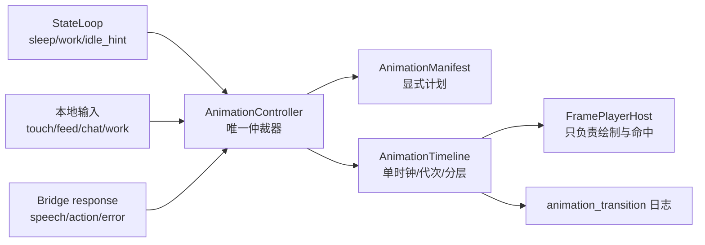

# BuddyShell v1 动画状态机整改规格

> 状态：`IMPLEMENTED / VALIDATED`（2026-07-12）
> 适用范围：`buddyshell/Anim/`、`MainWindow` 的动画调用边界、Gate A 动画验收
> 结论：controller/renderer/manifest/timeline、自动证据、30 分钟 soak 与人工视觉复核均已完成，Gate A 为 `PASS`。
> 生效方式：本文件已作为 `VPET_V1_SHELL_SPEC.md` §3 的整改补充；冲突处以本文件为准。

## 1. 目的

本整改解决的不是单个目录映射错误，而是 BuddyShell 动画层缺少完整状态机的问题。

已出现的故障包括：

- 睡眠 A 段被循环，角色反复拉被子；
- thinking A 段被循环，角色每 250ms 重新挠头；
- work A 段被循环，桌子反复落下；
- Eat 只播放后层，食物和手臂前层缺失；
- 服务端响应用默认站立动作抢占本地触摸、投喂和工作动作；
- 工作中触摸后无法稳定回到工作 B 循环；
- 相同 state 轮询、快速点击和异步响应之间缺少统一仲裁。

整改完成后的目标是：所有动画都由一个控制器按显式计划播放，具备确定的进入、循环、退出、分层、中断和恢复语义。

## 2. 根因与工程裁决

### 2.1 根因

当前实现并不是完整移植 VPet 的成熟动画系统，而是：

1. 使用 VPet 默认 PNG 素材；
2. `VPetCoreHost` 直接调用部分 `GraphCore/PNGAnimation` 接口，但没有复用完整素材解析、graph 注册和 `FoodAnimation` 编排；
3. 视觉不可用后启用自写 `FramePlayerHost`；
4. 自写播放器把素材目录当成普通独立帧序列，通过目录名和路径长度启发式选择；
5. `Play(intent, loop)` 无法表达 VPet 素材的真实语义。

VPet 素材至少包含以下结构：

- `A`：进入段；
- `B`：稳定循环段或主体动作段；
- `C`：退出段；
- `Happy/Nomal/PoorCondition/Ill`：状态变体；
- `back_lay/front_lay`：前后图层；
- 食物图片：运行时插入的中间层；
- 文件名末尾 `_125/_500/...`：单帧持续毫秒数。

只扫描到 PNG、能报告帧数和进程 30 分钟不崩溃，不能证明动画语义正确。

### 2.2 宿主路线

本轮锁定以下裁决：

- Gate A 和六拍验收只使用 `FramePlayerHost`；
- `VPetCoreHost` 已从产品树删除，不并行修复；
- 兼容播放器不再是“按文件夹轮播”的降级实现，而是实现完整的显式状态机和分层时间线；
- `eval/acceptance/v1/spike/decision.md` 的“默认素材可见”证据不足，整改落地时必须补 deviation 记录；
- 只有完成与本规格相同的 manifest、阶段、分层和中断测试后，才允许重新评估 VPetCore 路线。

### 2.3 禁止继续使用的模式

以下模式整改后必须删除或隔离在非产品代码中：

- 按 `ScoreFolder + path.Length` 静默选择任意动画目录；
- 把 `A` 或 `C` 当作循环段；
- 每个图层使用独立定时器自由运行；
- 服务端响应直接调用 `Play(...)`；
- state 每轮轮询都重启动画；
- 一次性动作完成后写死回 `Idle`；
- 缺素材时静默退到任意 `Default`，但仍对外报告成功。

## 3. 范围

### 3.1 本轮必须覆盖

- 基线：`Idle`、`Sleep`、`Work`；
- idle 活动：`Read`、`Write`、`Gaze`、`Stretch`；
- 本地即时动作：`TouchHead`、`TouchBody`、`Eat`、`Drink`；
- 请求等待：`Think`；
- 服务端表达：`Neutral/Talk`、`Happy/Greet`、`Worried/Concern`、`Alert/Safety`；
- 进入、循环、退出、分层、打断、排队、恢复；
- state 轮询幂等；
- 断网、超时、重连和应用重启后的动画恢复；
- 动画切换日志、确定性测试时钟和截图序列。

### 3.2 本轮不覆盖

- 新角色、新服装和创意工坊素材；
- 骨骼动画、插值变形和商业级动作混合；
- TTS 口型；
- QQ、Web 或移动端动画；
- VPet 游戏层、数值系统和商店；
- 六拍的记忆回流、七日周检和实验结论。

## 4. 不可违反的动画不变量

1. **唯一所有者**：同一时刻只有 `AnimationController` 可以修改画面；窗口、网络回调和 StateLoop 不得直接控制播放器。
2. **显式素材**：产品动画必须来自受版本控制的 manifest；不得运行时猜目录。
3. **阶段正确**：A 最多一次，B 按计划一次或循环，C 最多一次。
4. **共享时钟**：多图层使用同一单调时间轴；不允许各图层独立漂移。
5. **无空白帧**：切换时保留上一张完整合成帧，直到下一张可显示。
6. **轮询幂等**：相同 baseline key 的 state 更新不得重启 A 或 B。
7. **本地优先**：触摸第一帧从按下到显示 `<100ms`，不等待网络。
8. **响应不抢占**：touch/feed/work 的服务端响应默认只显示 speech；动画动作必须通过仲裁器排队。
9. **恢复动态计算**：一次性动作结束后重新解析当前上下文，不使用启动动作时保存的旧状态。
10. **取消可证明**：每次播放有 generation id；旧 timer/callback 在 generation 变化后不得生效。
11. **失败可见**：素材缺失、图层时长不一致和解码失败必须写错误日志并让 Gate A 失败。
12. **业务时钟不下放**：睡眠与 work 是否成立仍由服务端 state 和当前 session 决定，播放器不自行计算时间。

## 5. 总体架构



职责边界：

| 组件 | 负责 | 不负责 |
|---|---|---|
| `StateLoop` | 提供服务端 baseline 输入 | 直接播放动画 |
| `MainWindow` | 把 UI/网络事件转换成 request | 判断素材目录、恢复目标 |
| `AnimationController` | 仲裁、阶段切换、中断、恢复 | 解码 PNG、命中检测 |
| `AnimationManifest` | intent→素材/阶段/图层规则 | 运行时状态 |
| `AnimationTimeline` | 共享时钟、frame cursor、generation | 产品优先级 |
| `FramePlayerHost` | WPF 合成、缓存、触摸命中 | 业务状态与网络 |

## 6. 状态模型

### 6.1 状态分层

```text
AnimationState
├─ Baseline
│  ├─ Sleep
│  ├─ Work
│  └─ Idle
│     ├─ Default
│     ├─ Read
│     ├─ Write
│     └─ Gaze
├─ Transient
│  ├─ TouchHead
│  ├─ TouchBody
│  ├─ Eat
│  ├─ Drink
│  ├─ Stretch
│  └─ SpeechReaction
└─ Pending
   └─ Think
```

`Baseline` 是恢复目标；`Transient` 播完后恢复；`Think` 与一个 chat correlation id 绑定，可被本地动作暂时覆盖，但请求仍未完成时应恢复到 Think B。

### 6.2 Baseline 解析

每次需要恢复时重新计算：

```text
state 不可用           → 保持最后一个有效 baseline，不推导新业务状态
state.physio.sleeping   → Sleep
active_work_session     → Work
idle_hint=read          → Read
idle_hint=write         → Write
idle_hint=gaze          → Gaze
其他                    → Idle.Default
```

这是 `sleep > work > hint` 的唯一实现位置。

工作 session 在睡眠窗创建时可以记录，但视觉 baseline 仍为 Sleep；醒来后若 session 仍有效才进入 Work。工作动作验收必须在非睡眠 state 下进行，不允许靠壳内时间判断绕过此规则。

### 6.3 阶段

| 阶段 | 语义 | 允许循环 | 完成后的默认去向 |
|---|---|---:|---|
| `Entry` | A，进入姿态 | 否 | Loop/Body |
| `Loop` | B，稳定状态 | 是 | 等待 request |
| `Body` | B，一次性动作主体 | 否 | Exit |
| `Exit` | C，退出姿态 | 否 | 动态 Resume |
| `Standalone` | 无 A/B/C 的完整一次性动作 | 否 | 动态 Resume |

## 7. 领域接口

现有 `Play(intent, loop)` 必须替换为语义请求。建议接口如下：

```csharp
public sealed record AnimationRequest(
    AnimationIntent Intent,
    AnimationSource Source,
    string CorrelationId,
    AnimationPriority Priority,
    IReadOnlyDictionary<string, string>? Payload = null);

public sealed record BaselineSnapshot(
    bool StateAvailable,
    bool Sleeping,
    bool WorkSessionActive,
    string IdleHint,
    PhysioLevels Levels,
    double Warmth);

public interface IAnimationController : IDisposable
{
    void UpdateBaseline(BaselineSnapshot snapshot);
    void Submit(AnimationRequest request);
    void Complete(string correlationId, AnimationOutcome outcome);
    AnimationSnapshot Snapshot { get; }
}
```

播放器接口降为纯渲染：

```csharp
public interface IAnimationRenderer : IDisposable
{
    UIElement View { get; }
    event EventHandler<TouchDetectedEventArgs>? TouchDetected;
    void Render(CompositedFrame frame);
    void SetWarmth(double warmth);
}
```

禁止在 `MainWindow` 中出现素材目录名。

## 8. 请求优先级与中断矩阵

### 8.1 优先级

| 优先级 | 请求 | 说明 |
|---:|---|---|
| 100 | renderer fault / shutdown | 立即停止时间线 |
| 90 | TouchHead / TouchBody | 第一帧 `<100ms` |
| 85 | Eat / Drink | 明确用户操作，动作期间防重复 |
| 80 | Work Entry / Work Exit | 结构性转场，不被网络响应截断 |
| 70 | chat response / safety reaction | 在当前更高优先动作完成后播放 |
| 60 | Think | 只在 chat pending 时成立 |
| 20 | baseline change | Sleep/Work/Idle 解析结果 |
| 10 | idle flourish | Stretch 等可丢弃动作 |

### 8.2 中断规则

| 当前状态 | 新请求 | 处理 |
|---|---|---|
| Baseline Loop | Touch | 立即进入触摸 A/B/C，完成后 Resume |
| Baseline Loop | Feed | 立即进入 Eat/Drink，完成后 Resume |
| Think | Touch/Feed | 暂停 Think；本地动作完成后，chat 仍 pending 则回 Think B |
| Think | chat response | Think C 一次，再播 response reaction，再 Resume |
| Touch | touch 再次到达 | 遥测仍上报；视觉去重，不重启当前触摸序列 |
| Touch | chat response | response 排队到触摸 C 之后 |
| Feed | touch | 触摸遥测上报；视觉不打断 Feed，必要时只显示 speech |
| Feed | feed 再次到达 | 2.65s 动作锁内忽略视觉和重复提交 |
| Work Entry/Exit | 任意网络响应 | speech 可显示；动画不得抢占结构性转场 |
| Work Loop | Touch/Feed/Chat | 临时动作会替换整张场景；结束后重播 Work A 落桌，再进入 Work B |
| Sleep Loop | Touch/Feed/Chat | 临时动作会替换整张场景；若仍 sleeping，重播 Sleep A 拉被子，再进入 Sleep B |
| 任意 | 相同 baseline poll | no-op，不重启动画 |
| 任意 | renderer fault | 保留最后完整帧、状态点红、写日志 |

### 8.3 Resume 算法

```text
若有更高优先级 queued request              → 播放 queued request
否则若 chat correlation 仍 pending         → Think B
否则若 phased baseline 场景已被替换         → ResolveBaseline() 的 A，再进入 B
否则                                         → ResolveBaseline() 的 B/Loop
```

不得把 `_baseline`、`_working`、`_thinking`、`_touching` 分散成互相独立且可矛盾的布尔值；这些信息统一放在 `AnimationControllerState`。

## 9. 显式动画 manifest

manifest 使用相对于 `petRoot` 的路径。当前 Steam 默认素材快照为：

```text
D:\steam\steamapps\common\VPet\mod\0000_core\pet\vup
```

产品代码只能读取 manifest，不得扫描后选择“最短目录”。

### 9.1 基线与 idle 活动

| Plan | Entry | Loop/Body | Exit | 实测时长 |
|---|---|---|---|---|
| `idle.default.normal` | — | `Default/Nomal/1` | — | Loop 1500ms |
| `sleep.normal` | `Sleep/A_Nomal` | `Sleep/B_Nomal` | `Sleep/C_Nomal` | 500/750/875ms |
| `work.write.normal` | `WORK/WorkONE/A_Nomal` | `WORK/WorkONE/B_1_Nomal` | `WORK/WorkONE/C_Nomal` | 1250/1625/1375ms |
| `idle.read.normal` | `WORK/Study/A_Nomal` | `WORK/Study/B_1_Nomal` | `WORK/Study/C_Nomal` | 1500/1375/1375ms |
| `idle.write.normal` | `WORK/Calligraphy/Nomal/A` | `WORK/Calligraphy/Nomal/B` | `WORK/Calligraphy/Nomal/C` | 3750/2500/3125ms |
| `idle.gaze.normal` | `IDEL/aside/Nomal/A` | `IDEL/aside/Nomal/B` | `IDEL/aside/Nomal/C` | 125/1250/125ms |
| `idle.stretch.normal` | — | `IDEL/yawning/Nomal`（Standalone） | — | 2250ms |

规则：

- `Stretch` 是可丢弃的一次性 idle flourish，不是 baseline；
- `Read/Write/Gaze` 的相同 hint 更新不得重播 Entry；
- hint 改变时先播旧计划 Exit，再播新计划 Entry；
- Sleep、Work 与 idle 活动切换同样遵循 Exit→Entry，但本地高优先动作可插入。

### 9.2 思考、触摸与表达

| Plan | Entry | Loop/Body | Exit | 实测时长 |
|---|---|---|---|---|
| `think.normal` | `Think/Nomal/A` | `Think/Nomal/B` | `Think/Nomal/C` | 250/1125/250ms |
| `touch.head.normal` | `Touch_Head/A_Nomal` | `Touch_Head/B_Nomal`（一次） | `Touch_Head/C_Nomal` | 375/1500/375ms |
| `touch.body.happy` | `Touch_Body/A_Happy/tb1` | `Touch_Body/B_Happy/tb1`（一次） | `Touch_Body/C_Happy/tb1` | 2125/2125/375ms |
| `speech.neutral` | `Say/Self/A` | `Say/Self/B_1`（一次） | `Say/Self/C` | 1125/1875/500ms |
| `speech.happy` | `Say/Shining/A` | `Say/Shining/B_1`（一次） | `Say/Shining/C` | 875/875/500ms |
| `speech.alert` | `Say/Serious/A` | `Say/Serious/B`（一次） | `Say/Serious/C` | 500/500/500ms |
| `speech.worried` | `State/StateONE/A_PoorCondition` | `State/StateONE/B_PoorCondition`（一次） | `State/StateONE/C_PoorCondition` | 750/2125/1000ms |

触摸只由本地命中触发动画。服务端 touch response：

- speech 可立即展示；
- action 仅在 manifest 明确要求且不重复本地反射时排队；
- 空 action 不得映射成 `Idle` 并抢占触摸动作。

### 9.3 Eat/Drink 分层计划

| Plan | 后层 | 运行时中层 | 前层 | 总时长 |
|---|---|---|---|---:|
| `feed.eat.normal` | `Eat/Nomal/back_lay` | food image + `info.lps` a0–a8 | `Eat/Nomal/front_lay` | 图层 2625ms / 物体 2675ms |
| `feed.drink.normal` | `Drink/Nomal/back_lay` | drink image + `info.lps` a0–a10 | `Drink/front_lay` | 图层 2500ms / 物体 2750ms |

分层约束：

- 三层共享同一 `elapsed`，各自按帧时长推进；
- 后层和前层总时长必须相等，否则 manifest validation 失败；
- 食物层逐段位置、宽高、旋转、透明度和显隐写入 manifest；坐标使用 VPet `FoodAnimatGrid` 的 500×500 左上角逻辑画布；
- Eat 宽度 57–65，Drink 宽度 77–78；禁止退化为居中的固定像素尺寸；
- 动作完成前禁止第二个 feed 视觉请求；
- bridge response 不得切换动画，只能显示 speech；
- 网络失败仍完整播放，并把事件进入 outbox。

当前产品食物 id 与默认 VPet 素材的临时映射：

| 产品 id | VPet 图片 |
|---|---|
| `congee` | `image/food/罗宋汤.png` |
| `curry` | `image/food/番茄意面.png` |
| `milk_tea` | `image/food/奶茶.png` |
| `coffee` | `image/food/咖啡饮料.png` |
| `water` | `image/food/矿泉水.png` |

前两项是语义近似，记为 P2 素材偏差；不阻断动作闭环，但最终证据必须披露。

### 9.4 状态变体

v1 首先锁定 `Nomal` 主路径。状态变体只允许由 manifest 选择：

```text
Ill                 → Ill（若完整 A/B/C 或完整 Standalone 存在）
Low/PoorCondition   → PoorCondition
Bright/Happy        → Happy
其他                → Nomal
```

若某变体缺少所需阶段，整条 plan 回退到 `Nomal`，不得混用 `Happy A + Nomal B + Poor C`。

## 10. 时间线与渲染

### 10.1 单调时间轴

`AnimationTimeline` 使用 `Stopwatch.GetTimestamp()` 或等价单调时钟，不使用墙钟。测试中注入 fake clock。

每个 session 包含：

```text
generation_id
request/correlation_id
plan_id
phase
phase_started_at
elapsed
layer cursors
loop_count
resume_reason
```

切换 request 时 generation 递增。timer tick、异步图片解码和完成回调执行前必须验证 generation。

### 10.2 分层推进

所有 layer 在同一个 tick 中根据相同 elapsed 计算当前 frame。禁止主层、前层各自拥有 `DispatcherTimer`。

帧选择：

```text
frameEnd[0] = duration[0]
frameEnd[n] = frameEnd[n-1] + duration[n]
current = first frameEnd > elapsed
```

Loop 使用 `elapsed % totalDuration`。一次性阶段达到 totalDuration 后只产生一次 completion。

### 10.3 预加载与缓存

- Entry 开始前至少同步准备第一帧；
- Loop 在 Entry 播放期间后台预加载；
- Bitmap 使用 `OnLoad` 后 Freeze；
- 缓存 key 为绝对路径 + LastWriteTime + length；
- 内存缓存有上限，默认 256 帧或 256MB，先到者生效；
- 解码失败保留上一完整帧，并触发 renderer fault。

### 10.4 透明帧与合成

VPet 素材可能包含透明区域。每一帧按完整画布合成；不得把透明区域错误地解释成“沿用上一帧像素”，除非 manifest 明确声明 delta frame（v1 manifest 不启用 delta）。

## 11. 事件接入规则

### 11.1 StateLoop

`StateLoop.Updated` 只调用：

```csharp
controller.UpdateBaseline(snapshot);
```

相同 baseline key 只更新 warmth/levels，不重启动画。

### 11.2 Touch

鼠标按下时立即 `Submit(TouchHead/TouchBody)`，随后异步发送 bridge event。响应进入 `Complete(correlationId, outcome)`，不得直接播放默认 action。

### 11.3 Feed

点击或拖拽时一次性生成 correlation id：

```text
Submit(Eat/Drink, payload:item)
POST feed(client_event_id)
speech → Bubble
success/failure → Complete
```

视觉锁与 bridge 幂等是两层防线，不能互相替代。

### 11.4 Chat

```text
发送 → Submit(Think, chat_turn_id)
回复 → Complete(chat_turn_id, response)
超时 → Complete(chat_turn_id, timeout)
401  → Complete(chat_turn_id, auth_error)
```

正常回复：Think C → SpeechReaction A/B/C → Resume。
超时/错误：Think C → Resume，同时显示错误气泡和状态点。

### 11.5 Work

```text
work_start 成功/进入 outbox → baseline context 标记 session active
非睡眠时：Work A → Work B loop
work_stop 成功/进入 outbox → session inactive
Work C → ResolveBaseline
```

work response 默认 speech-only。触摸、投喂和聊天的 transient 都会替换完整的 500×500 场景；完成后如果 session 仍 active 且非 sleeping，必须先重播 Work A 重建桌子场景，再进入 Work B。Sleep、Read、Write、Gaze 等带 A/B/C 的 baseline 同理，禁止从站立结束帧直接跳 B。

### 11.6 服务端表达

`ActionMapper` 只生成语义 request，不再返回一个可以直接播放的目录。空 action 表示“不新增动画请求”，不是 `Idle`。

## 12. 观测与证据

每次状态变化记录一条结构化日志：

```text
event=animation_transition
generation=42
request_id=...
correlation_id=...
source=touch|feed|chat|state|work
from_plan=work.write.normal
from_phase=loop
to_plan=touch.head.normal
to_phase=entry
reason=local_preempt
priority=90
resume_target=work.write.normal
folder=Touch_Head/A_Nomal
frame_count=2
duration_ms=375
```

另记录：

- `animation_complete`；
- `animation_resume`；
- `animation_deduplicated`；
- `animation_queued`；
- `animation_fault`；
- `layer_drift_ms`（测试构建）；
- `first_frame_latency_ms`。

日志不得包含 bridge token、LLM key、聊天全文或本地绝对用户目录；folder 写相对 `petRoot` 的路径。

## 13. 自动化测试

### 13.1 Manifest validation

启动前或测试中验证：

- 所有 Gate A plan 路径存在；
- 每阶段至少一帧；
- 文件名时长可解析且 `>0`；
- Eat/Drink 前后层总时长一致；
- Loop 总时长在合理范围；
- 同一 plan 的状态变体阶段完整；
- food id 均能找到图片；
- 不存在产品 intent 落到启发式目录。

### 13.2 Controller 单元测试

使用 fake clock 和 fake renderer，至少覆盖：

1. Sleep A 只一次，B 循环，退出时 C 一次；
2. Think A→B，回复后 C→reaction→baseline；
3. Think 被 Touch 暂停，Touch 完成后 pending chat 回 Think B；
4. Work A→B，Touch 完成后重播 A 重建桌子，再回 B；
5. Work Stop 播 C 后回解析出的 baseline；
6. Feed 三层在同一 elapsed 下推进，无漂移；
7. Feed 期间第二次点击被去重；
8. touch response 空 action 不打断本地序列；
9. 相同 state 连续 100 次更新不重启动画；
10. generation 变化后旧 completion 不生效；
11. renderer fault 保留上一帧并可恢复；
12. 断网不影响本地动作完成和 Resume。

### 13.3 视觉集成测试

测试构建用 canned bridge response，不调用真实 LLM。每条链保存带时间戳的截图序列和 transition log：

| 编号 | 动作链 | 必须观察 |
|---|---|---|
| V1 | Idle→Sleep→Idle | 不重复拉被子；起床 C 完整 |
| V2 | Idle→Think→Reply→Idle | 不快速挠头；收手后再回复 |
| V3 | Idle→Work→Stop→Idle | 桌子只落一次、只收一次 |
| V4 | Work→TouchHead→Work | 触摸 A/B/C 完整，重播 Work A 重建桌子后回 B |
| V5 | Work→Feed→Work | 三层完整，结束后重播 Work A 重建桌子 |
| V6 | Think→Touch→Think→Reply | 中断与恢复顺序正确 |
| V7 | Sleep→Touch→Sleep | 重播 Sleep A 重建被子后回 B |
| V8 | Eat/Drink 五个 item | 食物/饮料可见且前后层同步 |
| V9 | 断网触摸/投喂 | 本地动作正常，UI 不冻结 |
| V10 | 快速点击 10 次 | 无叠播、无 timer 泄漏 |

### 13.4 量化门槛

- 触摸第一帧 `<100ms`；
- 同 baseline poll 重启次数 `0`；
- A/C 重复次数 `0`；
- 多层漂移 `≤1` 个渲染 tick，目标 `<16.7ms`；
- 空白合成帧 `0`；
- 动作完成后错误 baseline 次数 `0`；
- 30 分钟随机动作 soak：未处理异常 `0`、UI 冻结 `0`；
- 10 次快速点击只允许 1 个有效视觉 session，bridge 幂等行为符合协议。

## 14. 人工 Gate A 验收

自动化全绿后，用户只验以下体验问题：

- 动作是否看起来完整；
- A→B→C 是否有明显闪白、跳站或重复起手；
- 触摸是否即时；
- 工作、睡眠和 thinking 被打断后是否回到正确状态；
- 食物是否在手和身体之间，大小是否明显违和；
- 透明背景、窗口 DPI 和控件布局是否正常；
- 连续使用 30 分钟是否出现新的明显问题。

P0/P1 必须清零。P2 记录后可进入六拍，但必须在证据包披露。

## 15. 实施步骤

### 阶段 A：冻结与建模

1. Gate A 保持 FAIL；停止继续添加动作；
2. 新建 `AnimationController/AnimationManifest/AnimationTimeline`；
3. 将本文件的 manifest 转为受版本控制的数据或强类型表；
4. 加入 manifest validation 和 fake clock。

### 阶段 B：播放器整改

1. `FramePlayerHost` 降为 renderer；
2. 删除多 timer，改为共享时间轴；
3. 实现合成帧、缓存、generation 和 fault；
4. 完成 Eat/Drink 三层与食物锚点。

### 阶段 C：调用边界整改

1. `MainWindow/StateLoop/TouchLayer` 只提交语义 request；
2. 删除 `ShowResponse → Play`；
3. chat/work/feed/touch 使用 correlation id；
4. 空 action 不再映射成 Idle；
5. baseline 解析集中到 controller。

### 阶段 D：测试与证据

1. 完成 controller 单元测试；
2. 完成 V1–V10 视觉集成测试；
3. 跑 30 分钟 soak；
4. 用户做一次集中人工验收；
5. P0/P1 清零后签 Gate A。

### 阶段 E：文档与裁决同步

1. 更新 `VPET_V1_SHELL_SPEC.md` §3；
2. 给 spike decision 增加视觉证据不足的 deviation；
3. 更新 `CODE_AUDIT.md`，区分后端测试和动画视觉测试；
4. Gate A 通过后才开始六拍证据采集。

## 16. 预计文件变更

```text
buddyshell/Anim/
  AnimationController.cs       # 唯一仲裁器
  AnimationControllerState.cs  # baseline/transient/pending/queue
  AnimationManifest.cs         # 显式素材表与 validation
  AnimationPlan.cs             # phase/layer/priority/resume 模型
  AnimationTimeline.cs         # fake-clock 兼容的共享时间轴
  FrameCache.cs                 # Bitmap 缓存
  FramePlayerHost.cs            # 纯 renderer
  IAnimationHost.cs             # 替换为 controller/renderer 接口
  AnimationIntent.cs            # 只保留语义映射
buddyshell/MainWindow.xaml.cs   # 只提交 request
buddyshell/TouchLayer.cs        # correlation + speech-only completion
buddyshell/StateLoop.cs         # baseline snapshot
tests 或 buddyshell.Tests/      # controller/manifest/timeline 测试
eval/acceptance/v1/animation/   # V1–V10 视觉证据
```

## 17. 回滚与发布策略

- 整改分支内允许保留 legacy player 作为对照，但不得作为 Gate A 候选；
- 新 controller 通过 V1–V10 前不替换已冻结发布产物；
- 若 manifest 中某个非六拍动作失败，只能将该动作标 P2 并从随机 idle 池移除，不能静默猜目录；
- Sleep、Think、Work、Touch、Feed 任一路径失败均为 P1，Gate A 不通过；
- crash、空窗、UI 冻结、数据丢失和 token 绕过仍是 P0；
- 不以回退 O1 插件作为动画故障的解决方案。

## 18. 完工定义

以下全部满足，动画整改才算完成：

- [x] 产品代码不再启发式选择动画目录；
- [x] `Play(intent, loop)` 调用从窗口和网络回调中消失；
- [x] 单一 controller 拥有 baseline、transient、pending 和 queue；
- [x] 单一 timeline 驱动全部图层；
- [x] manifest validation 全绿；
- [x] Sleep/Think/Work/Read/Write/Gaze 均按 A/B/C 工作；
- [x] TouchHead/TouchBody 完整；Release + 实际素材冷 controller 提交首帧 `0.82ms < 100ms`；
- [x] Eat/Drink 三层同步、官方 a0–aN 手部轨迹和五种食物自动测试完成；
- [x] 工作、睡眠、thinking 中的中断恢复矩阵自动测试全绿；
- [x] 相同 state 连续 100 次轮询不重启动画；
- [x] V1–V10 自动截图序列与 JSON 日志齐全；
- [x] 食物轨迹修正后的 Release 窗口 1810 秒无异常；真实素材随机动作 1800 秒/1680 次转场无错误；
- [ ] 用户人工验收无 P0/P1；
- [x] spike deviation、Shell Spec 和 Code Audit 已同步；
- [ ] Gate A 从 `FAIL` 改为 `PASS` 后才进入六拍。

## 19. 当前状态

截至 2026-07-12：

- 已实现单一 `AnimationController`、共享 `AnimationTimeline`、显式 `AnimationManifest`、纯 renderer 与帧缓存；
- 已从产品调用路径移除 legacy `Play(...)`，并删除 `VPetCoreHost` 与 Core NuGet；
- C# Release build 为 `0 warnings / 0 errors`，21 条状态机回归 + 安装素材/缓存校验全绿；
- `eval/acceptance/v1/animation/automated/` 已生成 V1–V10 共 53 张 PNG、10 份 transition log 与触摸首帧量化证据；
- 用户发现旧固定 96×96 食物未接手；已按默认素材 `info.lps` 的 a0–aN 轨迹改为 500×500 逻辑画布逐段 transform；
- 食物轨迹修正版窗口连续运行 1810 秒，未处理异常 `0`、持续响应；
- 修正版真实 Steam 素材随机动作运行 1800 秒、1680 次转场、最终队列 `0`、错误 `0`，工作集约 149 MiB、解码缓存 61 MiB；
- 尚缺用户对修正版真实交互的集中视觉复核；
- 因此 Gate A 仍为 `FAIL / 待验收`，不得标记六拍通过。
